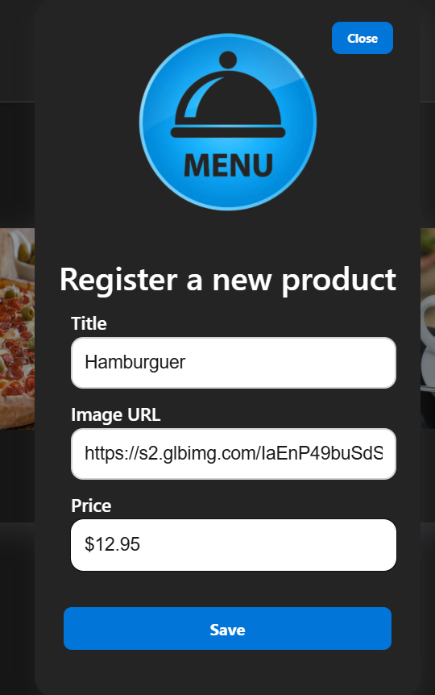
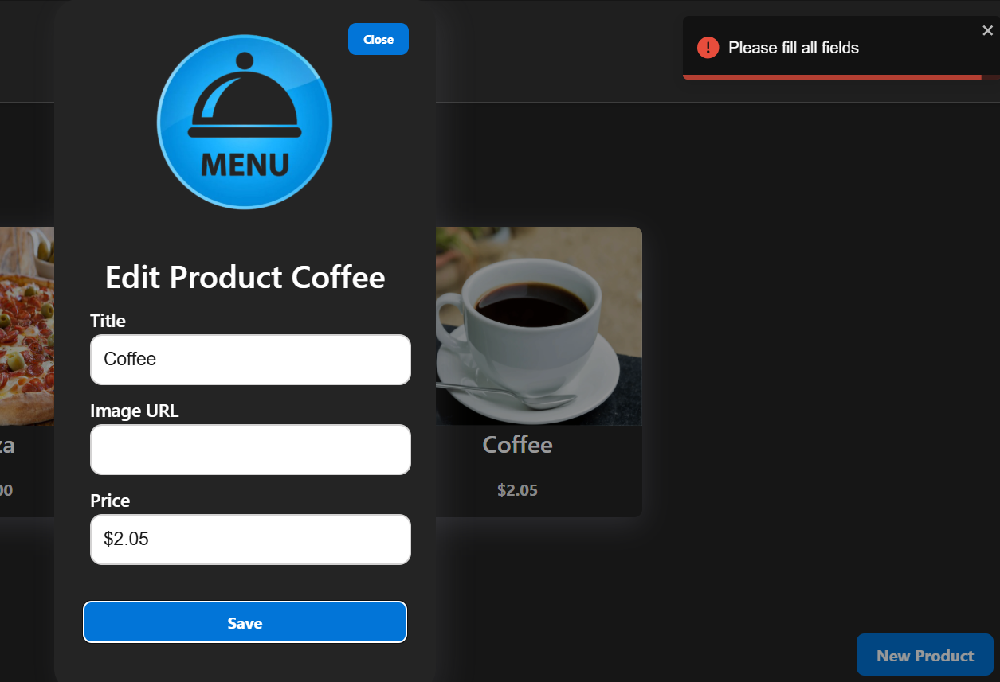

# Digital Menu (🚧 construction... 🚧)
<a id="readme-top"></a>

<br />
<div align="center">

  

  <h3 align="center">Digital Menu</h3>

  <p align="center">
    An incredible project using Java (SpringBoot) on the backend and React with Vite and Typescript on the frontend!
    <br />
  </p>
</div>

<p align="center">
  <a href="#about">About</a> •
  <a href="#built-with">Built With</a> •
  <a href="#getting-started">Getting Started</a> •
  <a href="#pre-requisites">Requisites</a> •
  <a href="#installation">Installation</a> •
  <a href="#backend">Backend</a> •
  <a href="#frontend">Frontend</a> •
  <a href="#project">Project</a> •
  <a href="#author">Author</a> •
  <a href="#network">Network</a>
</p>


## <h2 id="about">📃 About The Project </h2>

- Digital Menu home page;
- Add a new product only if you logged as 'admin';
- Notifications using Toasty;
- Backend running in container with Docker.
- Login;
- User only read information if not logged in as admin;
- Edit existing product information if the user is logged in as 'admin';
- Delete existing product if the user is logged in as 'admin';
- Loading.


<p align="right">(<a href="#readme-top">back to top</a>)</p>

## <h2 id="built-with">💎 Built With </h2>

* [![Java][Java]][Java-url]
* [![SpringBoot][SpringBoot]][SpringBoot-url]
* [![Postgres][Postgres]][Postgres-url]
* [![Docker][Docker]][Docker-url]
* [![Node][Node]][Node-url]
* [![React][React]][React-url]
* [![Typescript][Typescript]][Typescript-url]
* [![Vite][Vite]][Vite-url]
* [![CSS][CSS]][CSS-url]

<p align="right">(<a href="#readme-top">back to top</a>)</p>

## <h2 id="getting-started">⏱️ Getting Started </h2>

This is an example of how you can run your project locally.

To get a local copy up and running follow these simple example steps.

## <h2 id="pre-requisites">🛠️ Requisites</h2>

* Java <br>
    [Download Java and see the documentation how to install](https://www.java.com/en/)

* Docker <br>
    [Download Docker and see the documentation how to install and start](https://docs.docker.com/desktop/install/windows-install/)

* Node JS<br>
    [Download and install Node](https://nodejs.org/en/download)


<p align="right">(<a href="#readme-top">back to top</a>)</p>

## <h2 id="installation">🪄 Installation </h2>

1. Clone the repo
   ```sh
   git clone https://github.com/rike14/cardapio-java-react.git
   ```

<p align="right">(<a href="#readme-top">back to top</a>)</p>

## <h2 id="backend">⚙️ Backend </h2>

2. Run backend

     ```sh
       cd java-backend/
     ```

    * docker
    ```sh
      # for the first time or every time do you change the docker-compose.yml file do you need run this command, wait build the image and volume stop the terminal/cmd with ctrl+c command
      docker compose up 

      # after run the command docker compose up, then only run the command below to start container
      docker compose start

      # to access Pgadmin on http:localhost:8081 with email and password do you set on docker-compose.yml
      # POSTGRES_USER: postgres
      # POSTGRES_PASSWORD: master
      # POSTGRES_DB: postgres
      
      # then you register a server name what you want, on the tab 'Connection' do you need put on 'Host name/address': db then save like image below

      
      ----------------------------------------------------------------
      # remember to create the database before continuing with the name you want in the example I used "menu"
      ----------------------------------------------------------------

      # command stop de container if you needed
      docker compose stop
    ```


  *After running the backend on second time, the table's is created automatically if it doesn't exist, because first time you don't have a database created. You can see it in Pgadmin Painel as shown in the image below.*
    
  * Pgadmin login

    

  * Pgadmin database

    
  
  * Pgadmin steps to create connection with database
  
    

    <br>
    
    

    <br>

    

    <br>

    


  Now, inside IntelliJ, we will install the dependencies with Maven

  

  

  And finally you can see the backend running in the http://localhost:8080/product .

  

  
<br>

<p align="right">(<a href="#readme-top">back to top</a>)</p>

## <h2 id="frontend">🏜️ Frontend </h2>

3. Run frontend
   
    ```sh
    cd react-frontend/
    ```

   * npm
   ```sh
   npm install
   ```
   
    *Or with yarn*

   * yarn
   ```sh
   yarn
   ```

  * react
      ```sh
      npm run dev

      # or with yarn

      yarn dev

       # in the terminal see running on the url http://localhost:5173/
      ```

<p align="right">(<a href="#readme-top">back to top</a>)</p>

## <h2 id="project">🚀 Project </h2>

- [x] Home page where do you see and open modal to insert a product:
  
  

- [x] Modal to insert a product:
  
  

- [x] Edit a product:
  
  

- [x] Toast notification success:
  
  

- [x] Toast notification error:
  
  

- [x] Login page:
  
  

- [x] Loading:
  
  

- [x] Project preview:
  
  <video controls src=".github/video/preview.mp4" title="preview"></video>

<p align="right">(<a href="#readme-top">back to top</a>)</p>

## <h2 id="author"> 🧑🏼‍💻 Author </h2>

 
 <br>

[](https://www.linkedin.com/in/henriquekronhardt/)

## <h2 id="network">📱 Network </h2>

My site: [Henrique Kronhardt](https://devhenriquekro.com.br/)

---

Made with ❤️ by Henrique M. Kronhardt 👋🏽 [Get in touch!](https://www.linkedin.com/in/henriquekronhardt/)

<p align="right">(<a href="#readme-top">back to top</a>)</p>

<!-- MARKDOWN LINKS & IMAGES -->
[Java]: https://img.shields.io/badge/Java-ED8B00?style=for-the-badge&logo=openjdk&logoColor=white
[Java-url]: https://www.java.com/download/help/download_options_pt-br.html
[SpringBoot]: https://img.shields.io/badge/spring-%236DB33F.svg?style=for-the-badge&logo=spring&logoColor=white
[SpringBoot-url]: https://spring.io/quickstart
[React]: https://img.shields.io/badge/React-20232A?style=for-the-badge&logo=react&logoColor=61DAFB
[React-url]: https://reactjs.org/
[Typescript]: https://img.shields.io/badge/typescript-%23007ACC.svg?style=for-the-badge&logo=typescript&logoColor=white
[Typescript-url]: https://www.typescriptlang.org/
[Vite]: https://img.shields.io/badge/vite-%23646CFF.svg?style=for-the-badge&logo=vite&logoColor=white
[Vite-url]: https://vitejs.dev/
[CSS]: https://img.shields.io/badge/CSS3-1572B6?style=for-the-badge&logo=css3&logoColor=white
[CSS-url]: https://developer.mozilla.org/en-US/docs/Web/CSS
[Postgres]: https://img.shields.io/badge/postgres-%23316192.svg?style=for-the-badge&logo=postgresql&logoColor=white
[Postgres-url]: https://www.postgresql.org/
[Docker]: https://img.shields.io/badge/docker-%230db7ed.svg?style=for-the-badge&logo=docker&logoColor=white
[Docker-url]: https://www.docker.com/
[Node]: https://img.shields.io/badge/node.js-6DA55F?style=for-the-badge&logo=node.js&logoColor=white
[Node-url]: https://nodejs.org
